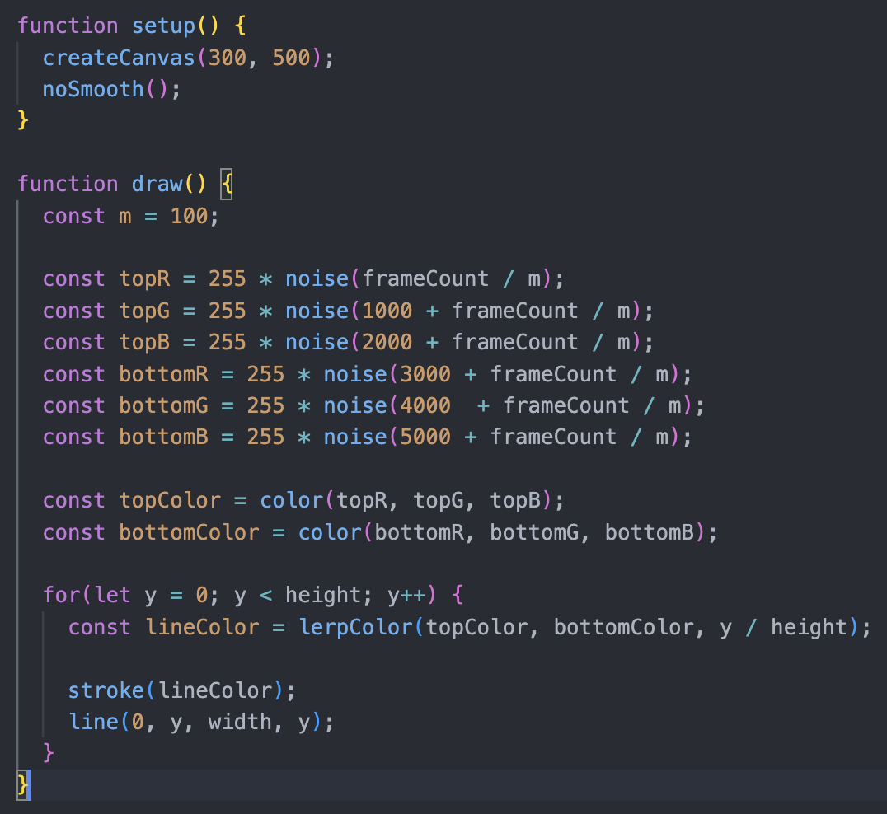

# Quiz 8

#### **Part One:**

The imaging technique I'll be employing is called color lerp. This method allows me to set two colors and create a natural gradient effect between them using mathematical formulas. Such color transitions are visually appealing compared to single colors. I aim to utilize this technique to render backgrounds and even some shapes, adding depth and visual richness to my project. In addition, I plan to extract some colors from the gradient produced by color lerp and apply them to various shapes or lines in my project, thereby maintaining visual coherence and harmony throughout the design.

#### **Part Two:**

[URL for the code](https://editor.p5js.org/KevinWorkman/sketches/OdeY6jRpI)

Three main techniques used to achieve this effect:

1. The developer used the noise function to generate Perlin noise, which can produce natural textures and smooth transitions between two colors.
2. FrameCount increments with each frame. The developer used it to control the speed and pattern of color effects and make animations.
3. The developer used lerpColor() to smoothly blend two colors based on a value between 0 and 1. It creates natural gradient transitions between the top color and the bottom color.
